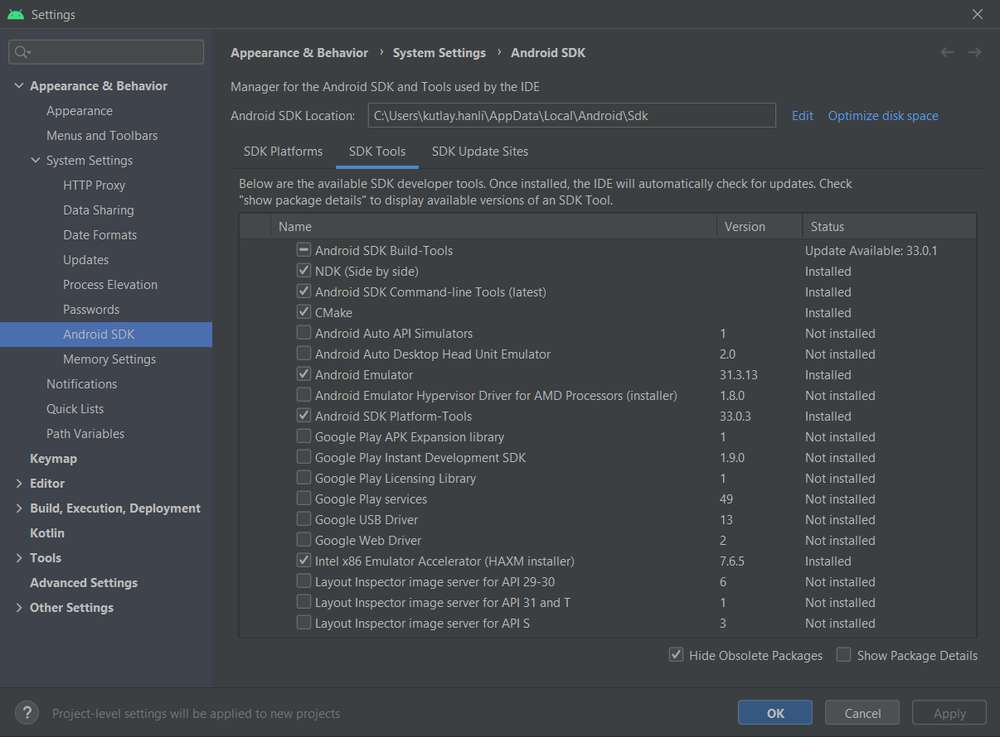

# flutter_demo

This project will demonstrate Flutter capabilities on Windows and Android with ffi.

## Getting Started

Install the following software to start

## How to install Flutter and Android Studio?

 - [Download Flutter](https://docs.flutter.dev/get-started/install)
 - [Download Android Studio](https://developer.android.com/studio)
 Install Flutter plugin in android studio and AVD for virtual Android devices.
 - To install Flutter plugin: File -> Settings... -> Plugins -> Search and install Flutter.
 - Add your Flutter SDK path to Android Studio: File -> Settings... -> Languages & Frameworks -> Flutter -> add the flutter sdk path where you extracted the the in the first step.
 - Install the following components from File -> Settings... -> Appearance & Behaviour -> System Settings -> Android SDK -> SDK Tools
 - 
 - Create and launch Android Virtual Device: Tools -> Device Manager -> Create/Start device.
 - Create an in IDE terminal: View -> Tool Windows -> Terminal.
 - Finish installing Flutter: run `$(Your flutter SDK Path)\bin\flutter doctor` and complete missing steps.

## FFIGEN
 - [Package Pub.dev page](https://pub.dev/packages/ffigen)
Install LLVM: `winget install -e --id LLVM.LLVM` for windows

## Run
 - Launch Android Virtual Device
 - Create an in IDE terminal: View -> Tool Windows -> Terminal.
 - Run `$(Your flutter SDK Path)\bin\flutter pub get`. This will pull required packages.
 - Run `$(Your flutter SDK Path)\bin\dart run ffigen`. This will create a Dart interface for our C library.
 - Run `$(Your flutter SDK Path)\bin\flutter run`. This will start building and running our application. It should prompt us to select a device to run on.
